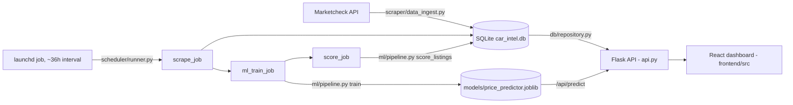

# Car Intel

A used car market intelligence pipeline that ingests live listings from the Marketcheck API, trains a price model to estimate fair market value, and scores each listing as a deal (0-100). A Flask API serves the results to a React dashboard.

---

## Results

Four model families are trained on the same feature set and compared: **Linear Regression**, a custom **Relaxed Lasso** (LassoCV variable selection followed by unregularized OLS refit on the selected variables), **Random Forest**, and **XGBoost**. The candidate with the lowest MAE on a held-out test set is selected for deployment (`ml/pipeline.py:591-596`). XGBoost has won every training run in the logged history.

**Evaluation setup** (`ml/pipeline.py:320-363`):
- 80/20 train/test split, `random_state=42`
- Target: `log1p(price)` (log-space regression), predictions converted back with `expm1` and a bias-correction offset (`log_calibration`) computed from the median training residual

**Held-out test set error**, reproduced directly against the current saved model (`models/price_predictor.joblib`, version `20260915_0658`, test set n=2,250):

| Segment | Median absolute % error |
|---|---|
| Overall | 3.99% |
| $20,000--35,000 (mainstream) | 2.87% |

These numbers were computed by re-running the pipeline's exact train/test split against the live database and scoring the saved model on the resulting held-out rows, not read off a log file.

---

## Architecture



**Ingestion** (`scraper/data_ingest.py`, `scraper/marketcheck_enrichment.py`, `scraper/api_usage.py`) pulls active listings from the Marketcheck REST API (no HTML scraping), rotating through configured search targets (`config/search_targets.json`) and zip codes, and tracks API call quota.

**Storage** (`db/models.py`, `db/repository.py`) is a SQLite database via SQLAlchemy with three tables: `car_listings`, `predictions`, and `popularity_snapshots`. Listings are upserted by `listing_id`; stale listings are marked inactive rather than deleted.

**Scheduled retrain and rescore** (`scheduler/runner.py`) orchestrates scrape, train, score, and popularity-snapshot jobs in sequence (`run_all`). In production this is triggered by a macOS launchd job that lives outside this repo (see Setup below for the equivalent cron line).

**Modeling** (`ml/pipeline.py`) builds engineered features (vehicle age, mileage transforms, cohort medians, luxury/body-type flags, one-hot categoricals), trains and compares the four model families above, and persists the winner with its metrics and calibration offset.

**API** (`api.py`) is a Flask app that reads from SQLite and the saved model to serve deals, stats, trends, and on-demand predictions.

**Dashboard** (`frontend/src/car-intel-dashboard.jsx`) is a React app (Recharts for charts) that calls the Flask API, configured via `REACT_APP_API_URL` (defaults to `http://localhost:5001/api`).

---

## API Reference

| Method | Endpoint | Purpose | Example response shape |
|---|---|---|---|
| GET | `/api/deals` | Top deals by score. Query: `limit`, `min_score`, `make`, `model`, `body` | `[{"listing_id": "...", "year": 2021, "make": "Honda", "model": "Accord", "price": 22000, "predicted_price": 23800, "savings": 1800, "deal_score": 72.5, "deal_label": "3 Stars", "mileage": 34000, ...}]` |
| GET | `/api/popular` | Most-listed year/make/model cohorts. Query: `limit` | `[{"rank": 1, "year": 2022, "make": "Toyota", "model": "Camry", "active_listings": 88, "avg_price": 26500, "median_price": 25900, ...}]` |
| GET | `/api/stats` | Global market snapshot | `{"active_listings": 14228, "makes": 47, "models": 612, "avg_price": 27431.2, "price_min": 3100, "price_max": 99500, "last_updated": "2026-09-21T00:00:00Z"}` |
| GET | `/api/trends` | Avg price by month for the top 5 makes over the last 7 months | `{"data": [{"month": "Mar", "toyota": 25100, "honda": 23900}], "makes": ["Toyota", "Honda", ...]}` |
| GET | `/api/listings` | Active listings (sampled to 800) for the price vs. mileage scatter plot | `[{"year": 2020, "make": "Ford", "model": "F-150", "price": 31000, "mileage": 41000, "deal_score": 61.0, "deal_label": "Fair Price", ...}]` |
| GET | `/api/market-popular` | Live Marketcheck popularity data, proxied. Query: `state` (default `CA`), `limit` | `[{"make": "Toyota", "model": "RAV4", ...}]` or `{"error": "..."}` |
| GET | `/api/recent-listings` | Live Marketcheck recent listings, proxied. Query: `make`, `model`, `rows` | `[{"id": "...", "vin": "...", "year": 2023, "price": 28000, "url": "...", "city": "Austin", "state": "TX"}]` |
| GET | `/api/predict` | On-demand price prediction. Required: `make`, `model`, `year`, `mileage`. Optional: `trim`, `accident_count`, `owner_count`, `state` | `{"predicted_price": 24310.0}` |

`/api/market-popular` and `/api/recent-listings` call the live Marketcheck API on every request and require `MARKETCHECK_API_KEY` to be set.

---

## Deal Scoring

Each listing's asking price is compared to the model's predicted fair value (`ml/pipeline.py:705-724`):

```
diff_pct = (predicted_price - actual_price) / predicted_price * 100
score = 50 + diff_pct * 1.25
score = clamp(score, 0, 100)
```

A positive `diff_pct` (asking price under prediction) raises the score; a negative one lowers it. `+20%` under market maps to 100, `0%` maps to 50, `-20%` or worse maps to 0.

| Score | Label |
|---|---|
| 90-100 | 5 Stars |
| 75-89 | 4 Stars |
| 60-74 | 3 Stars |
| 45-59 | 2 Stars |
| 0-44 | 1 Star |

---

## Setup

The database and trained model are not committed (see Limitations). You need your own Marketcheck API key to populate them.

```bash
# 1. Create a virtual environment
python3 -m venv venv
source venv/bin/activate

# 2. Install dependencies
pip install -r requirements.txt

# 3. Configure environment
cp .env.example .env
# edit .env: set MARKETCHECK_API_KEY (required), optionally MARKETCHECK_ZIP / MARKETCHECK_RADIUS / PORT

# 4. Build the database and train a model from scratch
PYTHONPATH=. python3 scheduler/runner.py --scrape-only   # ingest listings into a fresh car_intel.db
PYTHONPATH=. python3 scheduler/runner.py --train-only    # train and save models/price_predictor.joblib
PYTHONPATH=. python3 scheduler/runner.py --score-only    # score listings with deal_score / predicted_price

# 5. Start the API
PYTHONPATH=. python3 api.py    # http://localhost:5001

# 6. Start the frontend
cd frontend
npm install
cp .env.example .env   # optional, only needed if the API isn't on localhost:5001
npm start
```

### Scheduling

In production, retraining is triggered by a macOS launchd job that is **not part of this repo** (`~/Library/LaunchAgents/com.danielpark.carpricepredictor.plist`), running `scheduler/runner.py --once` on a `StartInterval` of 129600 seconds (36 hours). Cron cannot express an exact 36-hour interval (its fields only divide a 24-hour day), so the closest practical cron equivalent is a daily run:

```cron
# crontab -e — daily approximation of the launchd job (not an exact 36h match)
0 3 * * * cd /path/to/Car-Price-Predictor && PYTHONPATH=. venv/bin/python3 scheduler/runner.py --once >> logs/cron.log 2>&1
```

---

## Limitations and Next Steps

- No automated test suite for the core app. `onnx_export_test/` and `scripts/test_marketcheck_endpoints.py` are standalone experiments and smoke scripts, not CI-covered unit tests.
- The deal score is a simple linear heuristic on predicted-vs-actual price gap. It isn't calibrated against actual sale outcomes.
- The model doesn't see vehicle condition or options data, since Marketcheck doesn't return either in structured form. This is the largest known gap versus production pricing tools.
- Retraining depends on a single machine's launchd job; it won't run while that machine is asleep or off, and there's no alerting if a run silently fails.
- The saved model is a single `models/price_predictor.joblib` file with no versioning or rollback if a bad training run gets deployed.
- `requirements.txt` includes `gunicorn`, but neither `Procfile` nor `render.yaml` currently invoke it; both run the Flask dev server directly.

---

## Repo Structure

```
Car-Price-Predictor/
├── api.py                        # Flask REST API (port 5001)
├── start.py                      # Startup wrapper used by Procfile/render.yaml
├── requirements.txt
├── .env.example                  # Backend environment variables
├── config/
│   ├── search_targets.json       # Scrape target definitions (zip rotation, body types)
│   └── trim_rankings.json        # Trim-level ranking data used in feature engineering
├── scraper/
│   ├── data_ingest.py            # Marketcheck API client, upserts into SQLite
│   ├── marketcheck_enrichment.py # Popularity / recent-listings enrichment endpoints
│   └── api_usage.py              # API call quota tracking
├── db/
│   ├── models.py                 # SQLAlchemy models (car_listings, predictions, popularity_snapshots)
│   └── repository.py             # Query/CRUD layer
├── ml/
│   └── pipeline.py               # Feature engineering, training, scoring, popularity snapshots
├── scheduler/
│   └── runner.py                 # Orchestrates scrape -> train -> score -> popularity jobs
├── scripts/
│   ├── model_sanity_check.py     # Directional/sanity checks on model predictions
│   └── score_audit.py            # Deal score distribution report
├── onnx_export_test/             # Standalone ONNX export experiment (not part of the app)
├── frontend/
│   ├── .env.example              # Frontend environment variables (REACT_APP_API_URL)
│   └── src/
│       ├── car-intel-dashboard.jsx
│       ├── components/
│       └── utils/
└── data/                         # Runtime state (API usage counters, scrape cursors), gitignored
```
