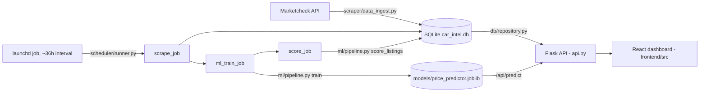

# Car Intel

A used car market intelligence pipeline that ingests live listings from the Marketcheck API, trains a price model to estimate fair market value, and scores each listing as a deal (0-100). A Flask API serves the results to a React dashboard.

---

## Results

Four model families are trained on the same features and the same split: **Linear Regression**, a custom **Relaxed Lasso** (LassoCV variable selection, then an unregularized OLS refit on the selected variables), **Random Forest**, and **XGBoost**.

**Evaluation setup** (`ml/pipeline.py:318-332`, `db/models.py:93`):
- Rows come from the `training_pool_v` SQL view: price $3k-100k, mileage 0-400k, `days_listed` <= 365, last seen within 180 days, and **one row per VIN** (the latest snapshot). Dealers relist the same car under a new listing id, usually after a price cut, so without this the test set contains near-identical twins of training cars.
- Train/validation/test split **grouped by VIN** (`GroupShuffleSplit`, seed 42): test is 20% of cars, validation is 20% of the rest (64/16/20). No VIN appears in more than one split; the audit script asserts this and records the overlap counts (all 0).
- The **test split is used once, for reporting.** The model is selected on validation MAE (`ml/pipeline.py:607`), and the bias-correction offset (`log_calibration`, median log residual) is fit on validation (`ml/pipeline.py:622`).
- Target: `log1p(price)`, converted back with `expm1` minus the calibration offset, as production serves it.

**Held-out test results**, from [`outputs/holdout_metrics.json`](outputs/holdout_metrics.json), produced by `scripts/holdout_audit.py` (9,688 unique cars as of 2026-09-27; 6,200 train, 1,550 val, 1,938 test). Median abs % error is `median(|pred - true| / true)`. Price segments filter on the **true** asking price.

| Model | Val MAE | Test MAE | Median abs % error | $20-35k (n=652) | < $10k (n=254) |
|---|---|---|---|---|---|
| Linear | $5,024 | $5,346 | 14.1% | 11.0% | 28.1% |
| Relaxed Lasso | $4,395 | $4,798 | 12.5% | 9.2% | 19.3% |
| Random Forest | $3,797 | $3,821 | 9.1% (95% CI 8.6-9.7) | 5.4% (4.8-6.5) | 19.0% |
| **XGBoost (selected)** | **$3,594** | **$3,658** | **9.0% (95% CI 8.4-9.6)** | **6.3% (5.5-7.0)** | **17.3%** |

CIs are percentile bootstraps over the test set (2,000 resamples). XGBoost is selected because it has the lowest validation MAE. It also has the lowest overall test median error, but its margin over Random Forest is not significant: the paired bootstrap CI for the difference is -0.7 to +0.4 points overall. In the $20-35k segment Random Forest is better (5.4% vs 6.3%), a difference whose CI (-0.1 to +1.5 points) just includes zero.

Caveats:
- The target is the dealer's **asking** price, not a sale price, so "error" means distance from the asking price.
- One random split of cars listed over the same period, not a time-ordered backtest. It measures fair value for current inventory, not forecasting.
- Segment n is small (254 cars under $10k), and the scheduled job retrains on newer data every run, so the live model's error will drift from these figures. Re-run the script to refresh them.
- The database is not committed (Marketcheck data), so the numbers reproduce only from the same DB snapshot. `rows_sha256` in the results file fingerprints the rows that were evaluated.

Earlier versions of this README reported much lower error figures. Those are retracted: they came from re-splitting a live database with a random, non-VIN-grouped split, which put training cars (and relisted twins of them) into the test set.

**Serving latency**, from `scripts/latency_bench.py` on an Apple M5 laptop (localhost, one sequential client, Flask server as started by `start.py`):

| Endpoint | p50 | p95 |
|---|---|---|
| `/api/predict` (live model inference) | 10.2 ms | 10.7 ms |
| `/api/deals?limit=100` (precomputed scores) | 13.8 ms | 16.6 ms |
| `/api/deals?min_score=0` (dashboard, all 12,843 graded listings) | 461 ms | 496 ms |

A full rescoring pass over 14,737 listings takes 0.2 s. Writing the scores to SQLite adds about 2 s.

---

## Architecture


```mermaid
flowchart LR
    MC[Marketcheck API] -->|scraper/data_ingest.py| DB[(SQLite car_intel.db)]
    LD[launchd job, ~36h interval] -->|scheduler/runner.py| SCR
    SCR[scrape_job] --> DB
    SCR --> TRAIN[ml_train_job]
    TRAIN -->|ml/pipeline.py train| MODEL[(models/price_predictor.joblib)]
    TRAIN --> SCORE[score_job]
    SCORE -->|ml/pipeline.py score_listings| DB
    DB -->|db/repository.py| API[Flask API - api.py]
    MODEL -->|/api/predict| API
    API --> WEB[React dashboard - frontend/src]
```

**Ingestion** (`scraper/data_ingest.py`, `scraper/marketcheck_enrichment.py`, `scraper/api_usage.py`) pulls active listings from the Marketcheck REST API (no HTML scraping), rotating through configured search targets (`config/search_targets.json`) and zip codes, and tracks API call quota.

**Storage** (`db/models.py`, `db/repository.py`) is a SQLite database via SQLAlchemy with three tables: `car_listings`, `predictions`, and `popularity_snapshots`. Listings are upserted by `listing_id`; stale listings are marked inactive rather than deleted.

**Scheduled retrain and rescore** (`scheduler/runner.py`) orchestrates scrape, train, score, and popularity-snapshot jobs in sequence (`run_all`). In production this is triggered by a macOS launchd job that lives outside this repo (see Setup below for the equivalent cron line).

**Modeling** (`ml/pipeline.py`) builds engineered features (vehicle age, mileage transforms, cohort medians, luxury/body-type flags, one-hot categoricals), trains and compares the four model families above, and persists the winner with its metrics and calibration offset.

**API** (`api.py`) is a Flask app that reads from SQLite and the saved model to serve deals, stats, trends, and on-demand predictions.

**Dashboard** (`frontend/src/car-intel-dashboard.jsx`) is a React app (Recharts for charts) that calls the Flask API, configured via `REACT_APP_API_URL` (defaults to `http://localhost:5001/api`).

---

## API Reference

| Method | Endpoint | Purpose | Example response shape |
|---|---|---|---|
| GET | `/api/deals` | Graded listings, best deal first. Query: `limit` (default: all), `min_score`, `make`, `model`, `body` | `[{"listing_id": "...", "year": 2021, "make": "Honda", "model": "Accord", "price": 22000, "predicted_price": 23800, "savings": 1800, "deal_score": 72.5, "deal_label": "3 Stars", "mileage": 34000, ...}]` |
| GET | `/api/popular` | Most-listed year/make/model cohorts. Query: `limit` | `[{"rank": 1, "year": 2022, "make": "Toyota", "model": "Camry", "active_listings": 88, "avg_price": 26500, "median_price": 25900, ...}]` |
| GET | `/api/stats` | Global market snapshot | `{"active_listings": 12854, "graded_listings": 12843, "makes": 47, "models": 612, "avg_price": 27431.2, "price_min": 3100, "price_max": 99500, "last_updated": "2026-09-21T00:00:00Z"}` |
| GET | `/api/trends` | Avg price by month for the top 5 makes over the last 7 months | `{"data": [{"month": "Mar", "toyota": 25100, "honda": 23900}], "makes": ["Toyota", "Honda", ...]}` |
| GET | `/api/listings` | Graded active listings (sampled to 800) for the price vs. mileage scatter plot | `[{"year": 2020, "make": "Ford", "model": "F-150", "price": 31000, "mileage": 41000, "deal_score": 61.0, "deal_label": "Fair Price", ...}]` |
| GET | `/api/market-popular` | Live Marketcheck popularity data, proxied. Query: `state` (default `CA`), `limit` | `[{"make": "Toyota", "model": "RAV4", ...}]` or `{"error": "..."}` |
| GET | `/api/recent-listings` | Live Marketcheck recent listings, proxied. Query: `make`, `model`, `rows` | `[{"id": "...", "vin": "...", "year": 2023, "price": 28000, "url": "...", "city": "Austin", "state": "TX"}]` |
| GET | `/api/predict` | On-demand price prediction. Required: `make`, `model`, `year`, `mileage`. Optional: `trim`, `accident_count`, `owner_count`, `state` | `{"predicted_price": 24310.0}` |

`/api/market-popular` and `/api/recent-listings` call the live Marketcheck API on every request and require `MARKETCHECK_API_KEY` to be set.

---

## Deal Scoring

Each listing's asking price is compared to the model's predicted fair value, and the gap is measured in units of **how wrong the model typically is at that price** (`ml/pipeline.py:742-790`). Only listings priced at or above `MIN_PRICE` ($3,000, `db/models.py:80`) are scored and shown: the model is trained on nothing cheaper.

```
diff_pct = (predicted_price - actual_price) / predicted_price * 100
z        = diff_pct / segment_error      # segment_error: median abs % error in this price band
score    = clamp(50 + 40 * z / 3, 0, 100)
```

`segment_error` is the selected model's median absolute % error on the **validation** split, per price band (under $10k, $10-20k, $20-35k, $35-60k, over $60k, by asking price). It is saved with the model at every retrain. On the current snapshot it runs from about 7% ($20-35k) to 20% (under $10k).

5 Stars needs a discount of at least **3x the band's typical error**. For roughly normal errors the median absolute error is about 0.67 sigma, so 3x is about 2 sigma: fewer than 1 in 40 fairly priced cars should look that cheap from model error alone. The same 20% discount is therefore 5 Stars on a $25k car (typical error ~7%) but only 3 Stars on an $8k car (~20%). Cheap cars stay listed and graded; they just need a much bigger discount before the grade claims a steal. On the current snapshot this cut 5-Star listings from 210 (73% under $10k) to 119 (2 under $10k).

A model saved before per-band errors existed falls back to a flat scale with 5 Stars at a 32% discount, which is the original formula (`50 + 1.25 * diff_pct`).

| Score | Label |
|---|---|
| 90-100 | 5 Stars |
| 75-89 | 4 Stars |
| 60-74 | 3 Stars |
| 45-59 | 2 Stars |
| 0-44 | 1 Star |

---

## Setup

The database and trained model are not committed (see Limitations). You need your own Marketcheck API key to populate them.

```bash
# 1. Create a virtual environment
python3 -m venv venv
source venv/bin/activate

# 2. Install dependencies
pip install -r requirements.txt

# 3. Configure environment
cp .env.example .env
# edit .env: set MARKETCHECK_API_KEY (required), optionally MARKETCHECK_ZIP / MARKETCHECK_RADIUS / PORT

# 4. Build the database and train a model from scratch
PYTHONPATH=. python3 scheduler/runner.py --scrape-only   # ingest listings into a fresh car_intel.db
PYTHONPATH=. python3 scheduler/runner.py --train-only    # train and save models/price_predictor.joblib
PYTHONPATH=. python3 scheduler/runner.py --score-only    # score listings with deal_score / predicted_price

# 5. Start the API
PYTHONPATH=. python3 api.py    # http://localhost:5001

# 6. Start the frontend
cd frontend
npm install
cp .env.example .env   # optional, only needed if the API isn't on localhost:5001
npm start
```

### Scheduling

In production, retraining is triggered by a macOS launchd job that is **not part of this repo** (`~/Library/LaunchAgents/com.danielpark.carpricepredictor.plist`), running `scheduler/runner.py --once` on a `StartInterval` of 129600 seconds (36 hours). The job runs the repo's `venv/bin/python3`, so it needs the step-1 virtualenv to exist. Without it, launchd fails silently with exit code 78 (check with `launchctl print gui/$(id -u)/com.danielpark.carpricepredictor`). Cron cannot express an exact 36-hour interval (its fields only divide a 24-hour day), so the closest practical cron equivalent is a daily run:

```cron
# crontab -e — daily approximation of the launchd job (not an exact 36h match)
0 3 * * * cd /path/to/Car-Price-Predictor && PYTHONPATH=. venv/bin/python3 scheduler/runner.py --once >> logs/cron.log 2>&1
```

---

## Limitations and Next Steps

- Test coverage is one assert-based script (`tests/test_eval.py`: VIN-grouped split disjointness and the scoring price floor), not CI. `onnx_export_test/` and `scripts/test_marketcheck_endpoints.py` are standalone experiments and smoke scripts.
- The deal score is a simple linear heuristic on predicted-vs-actual price gap. It isn't calibrated against actual sale outcomes.
- The model doesn't see vehicle condition or options data, since Marketcheck doesn't return either in structured form. This is the largest known gap versus production pricing tools.
- Retraining depends on a single machine's launchd job; it won't run while that machine is asleep or off, and there's no alerting if a run silently fails.
- The saved model is a single `models/price_predictor.joblib` file with no versioning or rollback if a bad training run gets deployed.
- `requirements.txt` includes `gunicorn`, but neither `Procfile` nor `render.yaml` currently invoke it; both run the Flask dev server directly.

---

## Repo Structure

```
Car-Price-Predictor/
├── api.py                        # Flask REST API (port 5001)
├── start.py                      # Startup wrapper used by Procfile/render.yaml
├── requirements.txt
├── .env.example                  # Backend environment variables
├── config/
│   ├── search_targets.json       # Scrape target definitions (zip rotation, body types)
│   └── trim_rankings.json        # Trim-level ranking data used in feature engineering
├── scraper/
│   ├── data_ingest.py            # Marketcheck API client, upserts into SQLite
│   ├── marketcheck_enrichment.py # Popularity / recent-listings enrichment endpoints
│   └── api_usage.py              # API call quota tracking
├── db/
│   ├── models.py                 # SQLAlchemy models (car_listings, predictions, popularity_snapshots)
│   └── repository.py             # Query/CRUD layer
├── ml/
│   └── pipeline.py               # Feature engineering, training, scoring, popularity snapshots
├── scheduler/
│   └── runner.py                 # Orchestrates scrape -> train -> score -> popularity jobs
├── scripts/
│   ├── model_sanity_check.py     # Directional/sanity checks on model predictions
│   └── score_audit.py            # Deal score distribution report
├── onnx_export_test/             # Standalone ONNX export experiment (not part of the app)
├── frontend/
│   ├── .env.example              # Frontend environment variables (REACT_APP_API_URL)
│   └── src/
│       ├── car-intel-dashboard.jsx
│       ├── components/
│       └── utils/
└── data/                         # Runtime state (API usage counters, scrape cursors), gitignored
```
